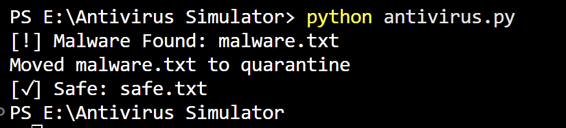

# Antivirus-Simulator
Basic Antivirus Simulation using Python with SHA-256 hashing, malware detection, and quarantine functionality.
# Basic Antivirus Simulation Using Python

## Overview

This project demonstrates a basic signature-based antivirus system developed using Python. The application scans files, generates SHA-256 hashes, compares them with known malware signatures, and quarantines detected malicious files.

## Features

* SHA-256 Hash Generation
* Signature-Based Malware Detection
* Folder Scanning
* Malware Quarantine
* Safe File Identification

## Technologies Used

* Python
* hashlib
* os
* shutil

## Project Workflow

1. Scan files in a directory.
2. Generate SHA-256 hash values.
3. Compare hashes with known malware signatures.
4. Detect malicious files.
5. Move malicious files to quarantine.

## Sample Output

## Author
Shreenidhi Nandana
CyberSecurity Intern

Shreenidhi Nandana

